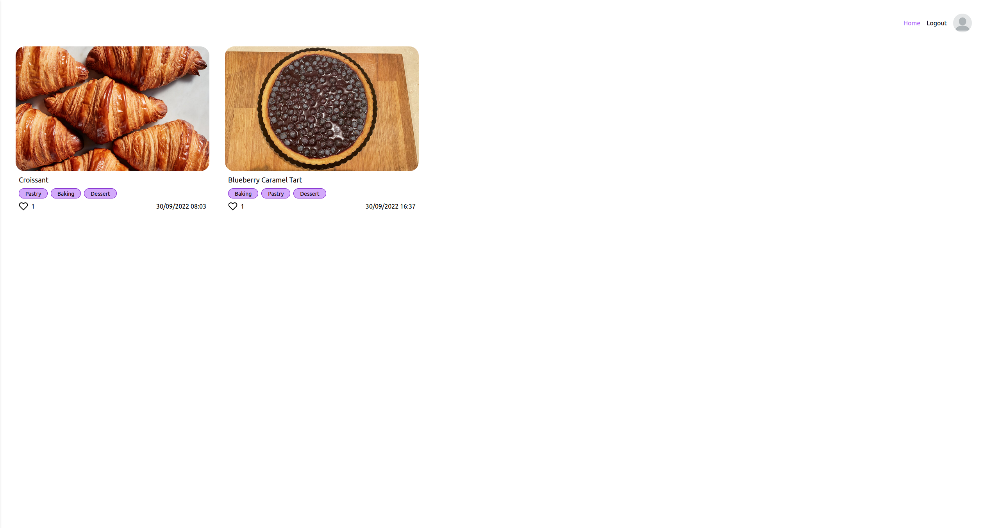

# Scroggin

Recipes but with none of the extra additional essays before the method.

> View a live demo [_here_](https://scroggin.au)

## Table of Contents

- [Scroggin](#scroggin)
  - [Table of Contents](#table-of-contents)
  - [General Information](#general-information)
    - [Why is the project named "Scroggin"?](#why-is-the-project-named-scroggin)
    - [What problem does it (intend to) solve?](#what-problem-does-it-intend-to-solve)
    - [What is the purpose of your project?](#what-is-the-purpose-of-your-project)
  - [Technologies Used](#technologies-used)
  - [Features](#features)
  - [Screenshots](#screenshots)
  - [Setup](#setup)
  - [Usage](#usage)
  - [Project Status](#project-status)
  - [Room for Improvement](#room-for-improvement)
    - [Room for improvement](#room-for-improvement-1)
    - [To do:](#to-do)
  - [Acknowledgements](#acknowledgements)
  - [Contact](#contact)

## General Information

### Why is the project named "Scroggin"?

[Scroggin](https://en.wiktionary.org/wiki/scroggin) is an Australian / New Zealand word for [trail mix](https://en.wiktionary.org/wiki/trail_mix). My year 10 Outdoor Ed teahcer taught me a wonderful acronym for remembering what goes into scroggin.

### What problem does it (intend to) solve?

The problem with most cooking / baking websites is that there is an essay and a half before you even get to the ingredients or method. This project aims to solve that by forcing users only to create step by step instructions.

### What is the purpose of your project?

To try and build something cool.

## Technologies Used

- tRPC - v9
- Next.js - v12
- TypeScript - v4
- Tailwind - v3
- Prisma - v4
- TipTap - v2 beta
- React Hook Form - v7
- Next Auth - v4
- Zod - v3

## Features

- User can create a recipe.
- Other users can like the recipe.
- Users can create an account.

## Screenshots

## Setup

1. Copy the `.env.sample` file, rename it to `.env` and paste in your env variables.
2. If you don't have a databsae setup, I like to use [railway](https://railway.app/) for remote PostgreSQL databases. It gives you 500 hours of up time a month free of charage.

## Usage

1. Run `npm run dev` to start the development server.

## Project Status

Project is: _in progress_. It will also be changing a **a lot** (when I can be bothered).

tRPC will be updated to v10 and most likely Next 13 for the major changes, rest of the packages will be updated to their latest versions eventually (looking at you TypeScript v5.)

## Room for Improvement

### Room for improvement

- Rendering recipes.
- Make liking a recipe more efficient and reactive.
- Don't send back user's hashed password.
- UI
  - Image responsivness is inconsistent.
  - Category labels are inconsistent.
  - Method and ingredients should be on tabs for mobile devices (this avoids having to scroll between the two.)

### To do:

- Create categories
  - Create a category table instead of relying on an array of strings (who thought this was a good idea).
  - Create a category page.
- Auto login user when registered an account.
- User is able to edit their details.
- Recipes are searchable by ingredient / category / name / author.
- Create more routes on nav bar.
- Add more auth solutions.

## Acknowledgements

- This project was inspired by [taste](https://www.taste.com.au).
- Many thanks to [Theo Browne and his cult of a community](https://t3.gg/links).

## Contact

Created by [Josh Hyde](https://joshhyde.me/) - feel free to contact me!
